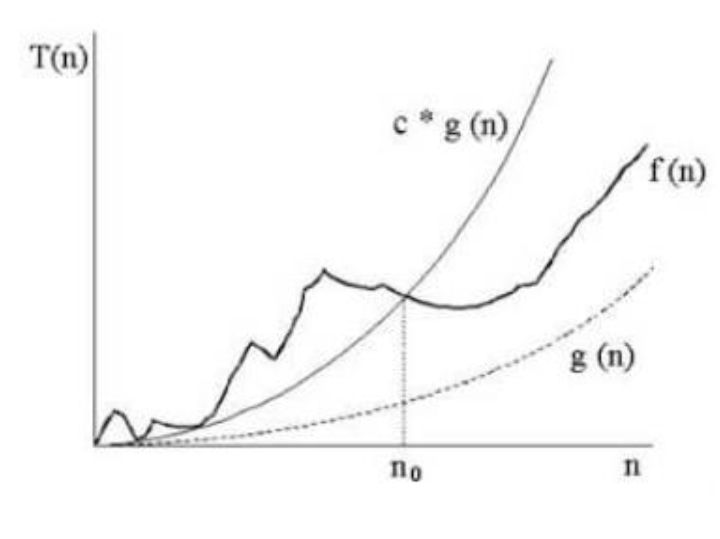
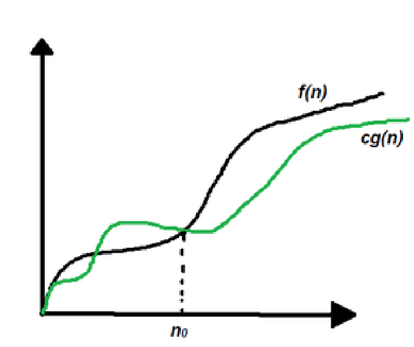

# Lecture 1 Time Complexity for Iterative Algorithms

## What is an algorithm?
An *algorithm* is the solving procedure for a specified problem.Each problem can have different solution,so algorithms differs from problem to problem.
## What is complexity?
*Complexity* is the amount of consumed time or space for an algorithm.
### Time Complexity T(n)
1. What is a step?
   - *Step* is a unit of work that can be executed in constant amount of time in a machine.
2. Why we defined steps?
   - Because,*the amount of steps* gives us the time complexity for an algorithm.
## Example
  Finding the sum of an array of numbers:
  ```C++
  int Sum(int A[],int N){
     int sum=0;
     int i=0;
       while(i<N){
       sum+=A[i];
       i++;
     }
     return sum;
}
```
Let's break the code line by line:
  1. **int sum=0;**
     - This is an integer assignment,so it is just one step. *T(n)=1*
  2. **int i=0**
     - This is also an integer assignment,so it is just one step. *T(n)=1*
  3. **while(i<N)**
     - This is a while loop,so it ends after N steps. *T(n)=N*
  4. **sum+=A[i];**
     - This expression is in the loop,so it ends after N steps. *T(n)=N*
  5. **i++;**
     - Same as the above. *T(n)=N*
  6. **return sum;**
     - This statements returns an integer.Because of returning just one value it takes 1 step. *T(n)=1*
  7. *Result*
      - The sum of all steps gives us the time complexity. *T(n)=3N+3*
## Some Notes
  - Constant time complexity is not about time.It is about steps.For example when we say *T(n)=1* this does not mean <strike>the algorithm completes its work in one seconds</strike>.It means that **it needs 1 step to complete this work**.
  - Linear time complexity is usually used when we have *loops*.For example,in above example we used while loop.It had *T(n)=N* time complexity,i.e,linear time complexity.
## Example
   Nested for loops:
```C++
   for(int i=1;i<=N;i++){
       for(int j=1;j<=N;j++){
        cout<<"Nested"<<endl;
       }
   }

```
Let's break the code line by line:
  1. **for(int i=1;i<=N;i++)**
     - This code executes N times.(Basic Math: The sum of the numbers 1 to N : (N-1)+1) *T(n)=N*
  2. **for(int j=1;j<=N;j++)**
     - This code executes N.N times.Because,theinner loop runs N times for each i.
  3. **cout<<"Nested"<<endl;**
     - This code prints Nested on the screen.It executes 1 time at each loop.
  4. *Result*
     - **T(n)=N^2**
## Some Notes
  - If nested loop count grows,complexity also grows.For example,3 nested for loops has N^3 complexity.
  - Matrix multiplication has 3 nested for loops.In addition inside of second loop ,there is a constant declaration.So it has N^3+N^2 time complexity.Let's see why:
## Example
   Matrix Multiplication:
```C++
    for(int i=0;i<N;i++){
      for(int j=0;j<N;j++){
        C[i][j]=0;
         for(int k=0;k<N;k++){
            C[i][j]+=A[i][k]*B[k][j];
          }
       }
   }
```  
  Let's break the code line by line:
  1. **for(int i=1;i<=N;i++)**
     - This code executes N times.(Basic Math: The sum of the numbers 1 to N : (N-1)+1) *T(n)=N*
  2. **for(int j=1;j<=N;j++)**
     - This code executes N.N times.Because,middle loop runs N times for each i.
  3. **C[i][j]=0**
     - This code is an integer assignment.It executes 1 time at each loop.So it executes N^2 times.
  4. **for(int k=0;k<N;k++)**
     - This code executes N.N.N times.Because innermost loop runs N times for each (i,j).
  5. **C[i][j]+=A[i][k]+B[k][j];**
     - This code contains assignment and addition and it executes 1 time.
  6. *Result*
     - *T(n)=N^3+N^2*
# Asymptotic Notations #
   **In general,what really matters is the "asymptotic" performance as N->infinity,regardless of what happens for small input sizes.**
## Big-O Notation
   **Big-O notation shows us the worst time complexity of an algorithm.**
  
   
   
   - *Formally,there are constants c,k(called witnesses) such that for all x>k:*
   - *f:R->R g:R->R*
   - *|f(x)| <= c.|g(x)|*
   - *f(x) is O(g(x)).*
   
### Example
    Show that T(n)=n+5 is O(n).
   - We need to show T(n)=2n+5<=c*n for all n>=k.
   - 2n+5<=7n for all n>=1 which is c=7 and k=1.
### Example
   f(x)=x^2,g(x)=x^2+2x+1.Show that f(x) is O(g(x)).
   - x^2<=x^2+2x+1 for c=1,k=0.
   - x^2<=**1**x^2+2x+1
### Example
    Show that n^2!=O(n).
   - Suppose n^2=O(n)
   - Then for all n>=k
   - |n^2|<=c|n|
   - |n|<=c
   - Impossible,because c and k are constant but n grows.
### Example 
    Show that n!=O(n^n)
   - 1.2.3....n<=n.n.n.n...n=n^n
   - For c=1 and k=1,n!=O(n^n)
### Example
    Give a big-oh estimate for f(x)=(x+1)log(x^2+1)+3x^2
   - Break the statement.
   - log(x^2+1)=2log(x)
   - (x+1).log(x^2+1)=O(x)
   - 3x^2=O(x^2)
   - O(x^2)+O(x)=O(x^2)
## Big-Omega Notation
   **Big-Omega notation gives us the best time complexity of an algorithm.**

   
   - *Formally,there are constants c,k(witnesses) such that for all x>k:*
   - *|f(x)|>=c|g(x)|*
   - *f(x) is Ω(g(x)).*

### Example
      8x^3+5x+7 is Ω(x^3).
   - 8x^3+5x+7>=8x^3
   - for c=8 and k=1.
## Some Notes
  - All comparison-based *searching algorithms* have a Ω(logN).
  - All comparison-based *sorting algorithms* have a Ω(NlogN).
## Big-Theta Notation(Same Order)
   **f(x)=O(g(x)) and f(x)=Ω(g(x))**
   - *Formally if there are positive constants c1,c2 and k such that*
   - *c1.g(n)<=f(n)<=c2(g(n)) for all n>=k
## Last Note
  logn-> sqrt(n) -> n -> nlogn -> n^2 -> 2^n -> n!
  
  ----------------------------------------------->
            
            Grows Faster!
